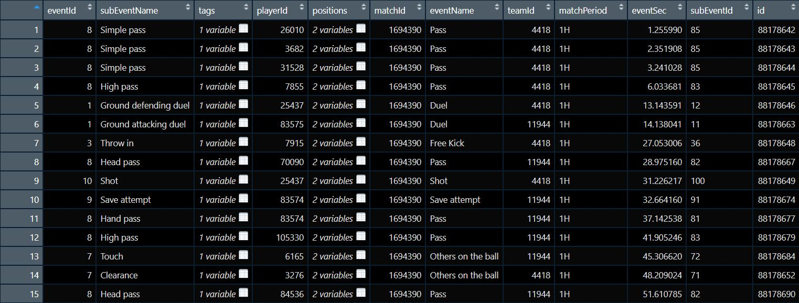
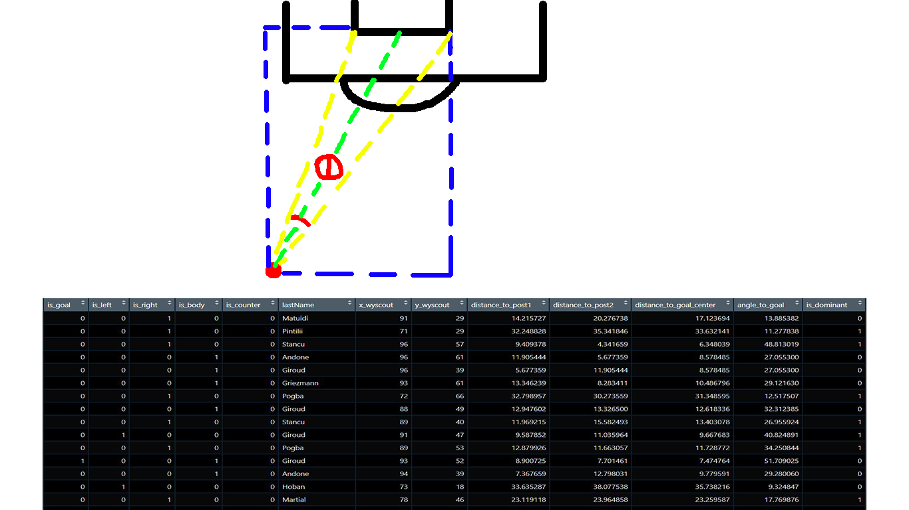
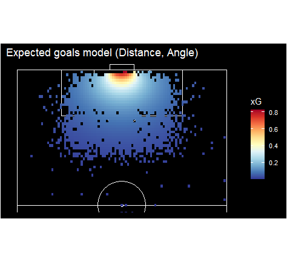
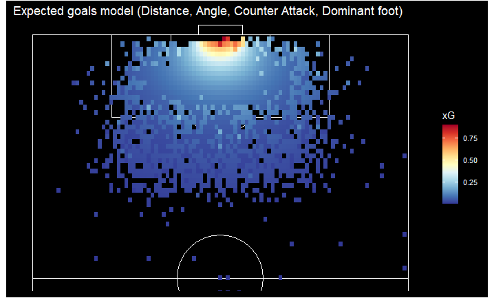
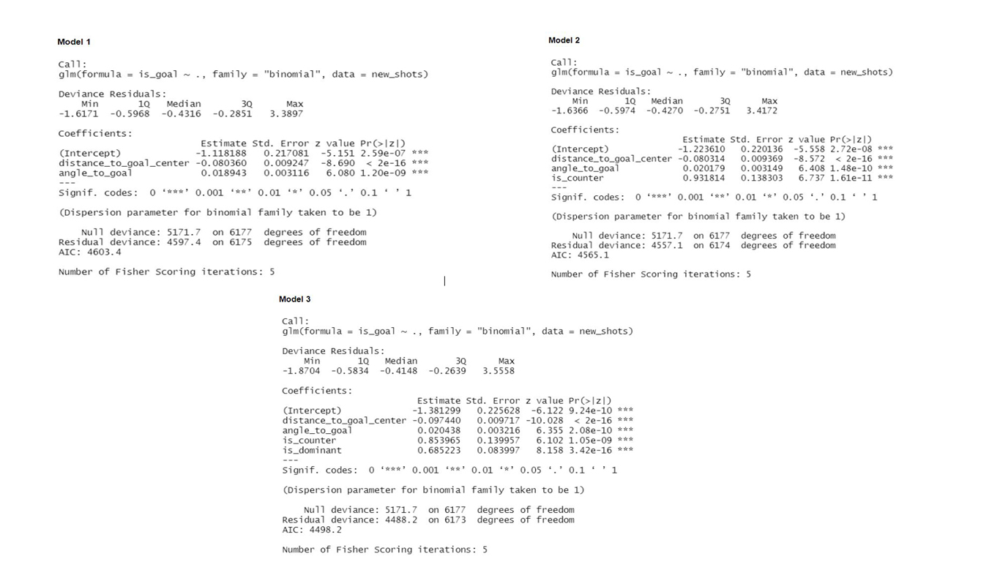
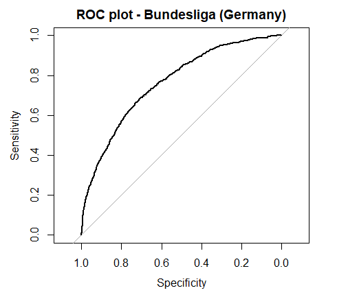

Understanding expected goals (xG)
========================================================
author: Izan Ahmed and Priyank Shah
date: 
autosize: true

Introduction
========================================================

- Expected goals is a measure of the quality of a shot.
- xG values range from 0 to 1, where an xG of 1.0 would indicate a 100% probability of a goal.  
- Using predictive modeling we assessed the goal-scoring probability in a soccer match and calculated the likelihood of the goal being scored.

 (xG of this goal is given as 0.0006)

Dataset
========================================================

- The dataset was provided by Wyscout. 
- It contains all spatio-temporal events that occur in each match for all matches in 7 different competitions: La Liga, Serie A, Bundesliga, Premier League, Ligue 1, FIFA World Cup 2018, UEFA Euro Cup 2016.
- A single match event contains information about the type of event, position, time, outcome, player and other characteristics.

Methods of Collection (1)
========================================================

- As we are only interested in shooting events, we decided to select the following variables from the dataset to predict the probability of a goal:
- 1. Distance to the goal center
- 2. The angle to goal 
- 3. The binary variable as to whether or not it was a counter attack
- 4. The binary variable as to whether or not it was from the dominant foot of the player.

Methods of Collection (2)
========================================================

- For distance, and angle to the goal, we used the position variable to extract the coordinates and later used trigonometric laws to compute each of them.
- For the counter attack or not and taken from dominant foot or not, we had to search through the tags variable to see if the specific tag we needed was present or not. Based on their presence, we made them into binary variables.

Analytic Methods
========================================================

- We decided to fit 3 logistic regression models with the binary variable for goal or not as the response all of them trained on the Premier League dataset (highest number of observations). 
- Our first model includes the distance, and the angle to goal as the explanatory variables.
- The second model includes the 2 primary explanatory variables along with another binary variable for counter attack or not. 
- The third and final model contains the previous 3 variables along with another binary variable, shot taken from the dominant foot or not.

- Moreover, we wanted to test the significance of the variables in our model so we added irrelevant variables, such as time to our model.
- Later on, we assessed the interactions of the variables based on the summary of the regression and statistically significant p-values.
- To further solidify the results, we performed the drop in deviance test to compare each model with others.
- Lastly, we took our best model and compared the predicted goals vs actual goals scored in 3 other large datasets, Bundesliga, Serie A and World Cup.

Results (1)
========================================================

- The results from all 3 models and their xG probabilities.

- 1.1: Model 1 Visualization

- 1.2: Model 2 Visualization

Results (2)
========================================================

- 1.3: Model 3 Visualization (Best)

Results (3)
========================================================

- 1.4: With the regression summaries where we can see their AIC Scores and p-values for the variables.

Results (4)
========================================================

- 1.5: With the insignificant variable.

- 1.6: Drop in Deviance Test between model 1 and 3

Results (5)
========================================================

- 1.7: ROC Curve when compared to Bundesliga (Germany)

- With an AUC (Area under Curve) of 0.7387 which is reasonably accurate.

Discussion
========================================================

- Our model achieved an average AUC of 0.7395, which is much better than random prediction, but there is still work to be done.

- Limited data available for testing, more detailed datasets can allow us to create more sophisticated models.

- We hope this model can be built on by other sports analytic researchers.

 
